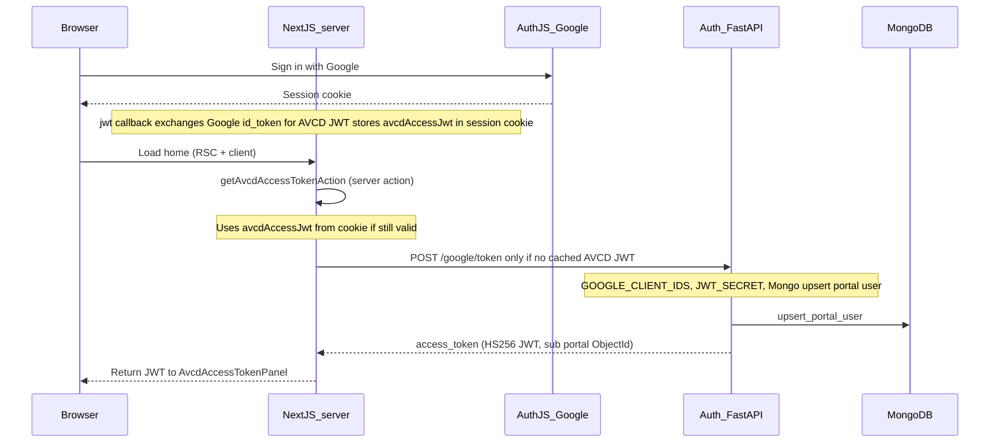

# Deep dive: from Google sign-in to AVCD access JWT (web)

This describes how the **access JWT** on the signed-in home page is produced, which services participate, and what must be configured. The Next.js app **does not call the main API**; it only uses the **auth issuer** when needed. Use the JWT yourself as `Authorization: Bearer …` against the API, or paste it into MCP (see below).

## End-to-end sequence



Public URLs behind Traefik: issuer at **`https://PUBLIC_HOST/auth/google/token`**. Internal Docker often uses **`AVCD_AUTH_URL=http://auth:8000`**.

## Step-by-step

### 1. Google session (Next.js only)

- [`auth.ts`](auth.ts) configures Google OAuth. On sign-in, the **`jwt`** callback calls the auth issuer with the Google **`id_token`**, then stores the returned **`avcdAccessJwt`** in the Auth.js JWT cookie and **drops** the Google token so the session stays under typical **4KB** cookie limits.
- If the issuer is unreachable at sign-in, the callback keeps **`googleIdToken`** (larger) as a fallback; [`lib/server/get-api-access-jwt.ts`](lib/server/get-api-access-jwt.ts) then exchanges it on demand via [`lib/server/session-token.ts`](lib/server/session-token.ts) (`getSessionJwt` / `getToken`).
- **Expiry:** AVCD JWT TTL matches issuer settings (often ~1 hour). **Sign out and sign in again** when it expires or after fixing `AVCD_AUTH_URL` / issuer config.

### 2. API access JWT (`POST .../google/token` on auth service)

- Implemented in [`auth/src/main.py`](../auth/src/main.py) (`google_issue_token`).
- **Requires:** `JWT_SECRET`, `GOOGLE_CLIENT_IDS` (include your Next.js `GOOGLE_CLIENT_ID`), Mongo reachable (same DB as API for `portal_users`).
- **Body:** `{ "id_token" }` — Google credential verified with `google-auth`.
- **Side effect:** `upsert_portal_user` → JWT `sub` is `portal:<ObjectId>`.

### 3. Web server action wiring

- [`app/actions/avcd-access-token.ts`](app/actions/avcd-access-token.ts): `getAvcdAccessTokenAction()` wraps [`getApiAccessJwt()`](lib/server/get-api-access-jwt.ts); [`lib/avcd-auth.ts`](lib/avcd-auth.ts) supplies **`AVCD_AUTH_URL`**.
- **Browser never talks to FastAPI or the issuer** for this flow; only the Next **server** uses `fetch`.

### 4. Optional: API keys on the API (not used by web today)

- To mint an **opaque API key** (`avcd_…`), call the API yourself: `POST /auth/api-keys` with `Authorization: Bearer <this JWT>` when **`AUTH_API_KEYS_ENABLED=true`**. See [`api/src/api_key_routes.py`](../api/src/api_key_routes.py) and [`api/JWT_AUTH.md`](../api/JWT_AUTH.md).

## Configuration checklist (JWT on home page)

| Layer | Variable / condition |
|--------|----------------------|
| Auth service | `JWT_SECRET` (must match API when you call the API with this JWT) |
| Auth service | `GOOGLE_CLIENT_IDS` includes web OAuth client ID |
| Auth service | Mongo reachable (`portal_users`) |
| Web | **`AVCD_AUTH_URL`** reachable from Next (`http://127.0.0.1:8010` or `http://auth:8000` in Compose) |
| Web | User signed in with Google; **sign in again** if token fails with “no Google sign-in token” (ID token is refreshed on login) |

## Quick manual verification

Auth issuer on port **8010** (local compose) or **8000** when calling the container directly:

```bash
# Requires a real Google id_token from your app or OAuth playground
TOKEN=$(curl -sS -X POST http://127.0.0.1:8010/google/token \
  -H "Content-Type: application/json" \
  -d '{"id_token":"YOUR_ID_TOKEN"}' | jq -r .access_token)

# Example: call the API with the JWT (API must be up; enable routes as needed)
curl -sS http://127.0.0.1:8000/health
```

## Using the JWT

- **MCP / Claude:** paste as API bearer token or `AVCD_API_BEARER_TOKEN` (see MCP `manifest.json` `user_config.api_bearer_token`).
- **GraphQL / REST:** `Authorization: Bearer <JWT>` for routes that accept the portal JWT (see [`api/JWT_AUTH.md`](../api/JWT_AUTH.md)).

## Common failures

| Symptom | Likely cause |
|---------|----------------|
| No API sign-in credential | Sign out and sign in again. At sign-in the server must reach **`AVCD_AUTH_URL`** to store **`avcdAccessJwt`** in the session cookie (avoids oversized Google `id_token` cookies). With **`AUTH_DEBUG=1`**, check `[avcd:auth-debug]` logs. |
| 503 on `/google/token` | `JWT_SECRET` or `GOOGLE_CLIENT_IDS` missing on auth service |
| 401 on `/google/token` | Expired or invalid `id_token`; sign in again |
| Connection error in UI | Auth down or wrong **`AVCD_AUTH_URL`** |
