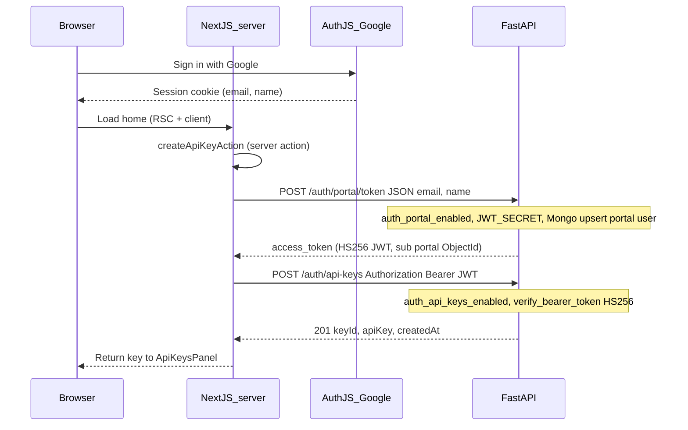

# Deep dive: from Google sign-in to MCP-ready API key

This describes how the **opaque `avcd_*` token** on the signed-in home page is produced, which services participate, and what must be configured.

## End-to-end sequence



## Step-by-step

### 1. Google session (Next.js only)

- [`auth.ts`](auth.ts) configures Google OAuth. No FastAPI call during login.
- Session must include **email** (required for portal token body) and usually **name** (or derivable from email local-part in [`api-keys.ts` actions](app/actions/api-keys.ts)).

### 2. Portal JWT (`POST /auth/portal/token`)

- Implemented in [`api/src/auth_routes.py`](../api/src/auth_routes.py) (`portal_issue_token`).
- **Requires:** `AUTH_PORTAL_ENABLED=true` (default), `JWT_SECRET` set, Mongo reachable.
- **Body:** `{ "email", "name" }` — email normalized to lowercase by Pydantic.
- **Side effect:** `upsert_portal_user` → JWT `sub` is `portal:<ObjectId>` ([`portal_users.py`](../api/src/portal_users.py)).
- **Not** authenticated with Google at the API boundary: the **Next server** must only forward the signed-in user’s email/name (trust boundary).

### 3. API key (`POST /auth/api-keys`)

- Implemented in [`api/src/api_key_routes.py`](../api/src/api_key_routes.py).
- **Requires:** `AUTH_API_KEYS_ENABLED=true` (defaults to **false** in [`settings.py`](../api/src/settings.py) and in **root** [`docker-compose.yml`](../docker-compose.yml) `${AUTH_API_KEYS_ENABLED:-false}`).
- **Header:** `Authorization: Bearer <portal JWT>`.
- [`verify_bearer_token`](../api/src/auth.py) decodes HS256 with `JWT_SECRET`; `sub` becomes `owner_sub` for [`create_api_key`](../api/src/api_keys.py).
- **Response:** One-time plaintext `apiKey` (`avcd_<uuid>_<secret>`).

### 4. Web server action wiring

- [`app/actions/api-keys.ts`](app/actions/api-keys.ts): `portalAccessToken()` then `createApiKeyAction()` with `AVCD_API_URL` from [`lib/avcd-api.ts`](lib/avcd-api.ts).
- **Browser never talks to FastAPI** for this flow; only the Next **server** uses `fetch`.

## Configuration checklist (token minting)

| Layer | Variable / condition |
|--------|----------------------|
| API | `JWT_SECRET` non-empty |
| API | `AUTH_PORTAL_ENABLED=true` (default) |
| API | `AUTH_API_KEYS_ENABLED=true` (**required**; off → 404 on `/auth/api-keys`) |
| API | Mongo + Redis up (Mongo used for portal users and API key docs) |
| Web | `AVCD_API_URL` reachable **from the Next process** (host dev: `http://127.0.0.1:8000`; same Compose network: `http://api:8000`) |
| Web | User signed in with Google; session has email |

## Quick manual verification

From the host (API on port 8000):

```bash
# Portal JWT (replace email/name)
TOKEN=$(curl -sS -X POST http://127.0.0.1:8000/auth/portal/token \
  -H "Content-Type: application/json" \
  -d '{"email":"you@example.com","name":"You"}' | jq -r .access_token)

# API key (requires AUTH_API_KEYS_ENABLED=true)
curl -sS -X POST http://127.0.0.1:8000/auth/api-keys \
  -H "Authorization: Bearer '$TOKEN'" \
  -H "Content-Type: application/json" \
  -d '{"name":"cli-test"}'
```

## Using the minted key

- **MCP / Claude:** paste as API bearer token or `AVCD_API_BEARER_TOKEN` (see MCP `manifest.json` `user_config.api_bearer_token`).
- **GraphQL / REST:** `Authorization: Bearer <apiKey>` when the API accepts opaque keys for those routes (see [`api/JWT_AUTH.md`](../api/JWT_AUTH.md)).

## Common failures

| Symptom | Likely cause |
|---------|----------------|
| 404 on portal token | `AUTH_PORTAL_ENABLED=false` |
| 503 on portal token | `JWT_SECRET` missing |
| 404 on api-keys | `AUTH_API_KEYS_ENABLED=false` (very common with Compose default) |
| Connection error in UI | API down; wrong `AVCD_API_URL` (e.g. `http://api:8000` from host Next) |
| “Invalid token” on api-keys | Wrong `JWT_SECRET` between mint and verify; expired JWT (retry) |
