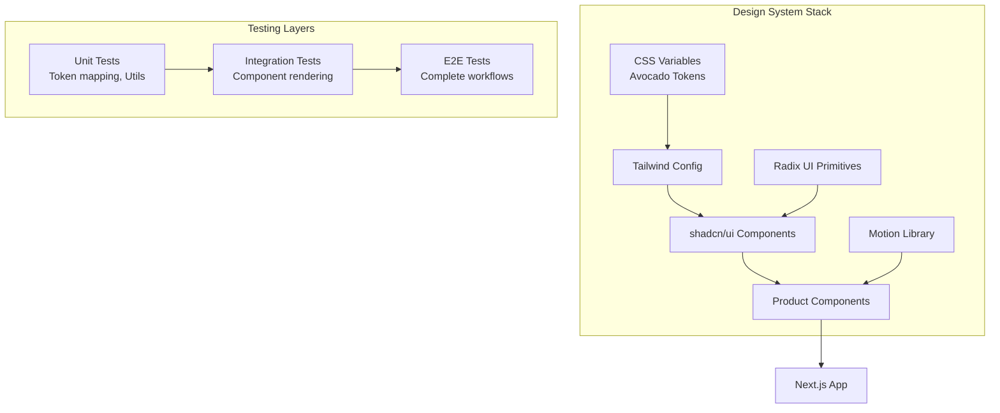

# shadcn/ui + Radix + Tailwind + Motion Setup (TDD Approach)

## Overview

Set up a complete design system stack (shadcn/ui + Radix UI + Tailwind CSS + Motion) for the Avocado web application using Test-Driven Development. This setup will enable rapid component development while maintaining the Avocado design system's minimal, white-canvas aesthetic.

**TDD Commitment:** Write tests before implementation, verify each phase passes before proceeding to the next.

**CRITICAL:** Do NOT proceed to next phase until all tests in current phase pass.

## Architecture



---

## Phase 0: Prerequisites & Verification (No Changes)

**Goal:** Verify environment and test framework before making any changes.

**Why First:** Establishes baseline, ensures we can test everything properly.

### Step 0.1: Verify Node & Package Manager

```bash
node --version
npm --version
```
**Expected:** Node v20.x, npm v10.x

### Step 0.2: Verify Jest is Working

```bash
cd /Users/genarionogueira/Documents/avcd/web
npm test -- --listTests
```
**Expected:** Jest discovers test files, no errors

### Step 0.3: Run Existing Tests

```bash
npm test
```
**Expected:** All existing tests pass (baseline)

### Step 0.4: Verify Next.js Build Works

```bash
npm run build
```
**Expected:** Build completes successfully

### Step 0.5: Document Current State

**Current Dependencies:**
- Next.js 15.5.14
- React 19.1.0
- Jest 30.3.0 (configured)
- TypeScript 5.x
- @testing-library/react 16.3.2

**Current Structure:**
- `/app` - Next.js app router
- `/lib` - Utility functions
- `/__tests__` - Test files
- Jest already configured with jsdom

**Test Gate:** ✅ All verifications complete, environment ready, baseline tests passing.

---

## Phase 1: Tailwind CSS Setup (Easiest)

**Goal:** Install and configure Tailwind CSS with Avocado design tokens.

**Why Second:** Configuration-only, no logic, can't break functionality. Foundation for everything else.

### Step 1.1: Write Tests FIRST

**File:** Create `__tests__/tailwind-config.test.ts`

```typescript
import { describe, it, expect } from '@jest/globals'
import * as fs from 'fs'
import * as path from 'path'

describe('Tailwind Configuration', () => {
  it('should have tailwind.config.ts file', () => {
    const configPath = path.join(process.cwd(), 'tailwind.config.ts')
    expect(fs.existsSync(configPath)).toBe(true)
  })

  it('should have postcss.config.mjs file', () => {
    const configPath = path.join(process.cwd(), 'postcss.config.mjs')
    expect(fs.existsSync(configPath)).toBe(true)
  })

  it('should have globals.css with Tailwind directives', () => {
    const cssPath = path.join(process.cwd(), 'app/globals.css')
    const cssContent = fs.readFileSync(cssPath, 'utf-8')
    
    expect(cssContent).toContain('@tailwind base')
    expect(cssContent).toContain('@tailwind components')
    expect(cssContent).toContain('@tailwind utilities')
  })

  it('should have Avocado design tokens as CSS variables', () => {
    const cssPath = path.join(process.cwd(), 'app/globals.css')
    const cssContent = fs.readFileSync(cssPath, 'utf-8')
    
    // Check for color tokens
    expect(cssContent).toContain('--bg:')
    expect(cssContent).toContain('--g50:')
    expect(cssContent).toContain('--g100:')
    expect(cssContent).toContain('--green:')
    
    // Check for spacing tokens
    expect(cssContent).toContain('--sp-')
    
    // Check for font tokens
    expect(cssContent).toContain('--sans:')
    expect(cssContent).toContain('--mono:')
  })

  it('should configure Tailwind with custom colors', () => {
    const config = require('../tailwind.config.ts')
    
    expect(config.theme.extend.colors).toBeDefined()
    expect(config.theme.extend.colors.gray).toBeDefined()
    expect(config.theme.extend.colors.green).toBeDefined()
  })

  it('should configure Tailwind with custom spacing', () => {
    const config = require('../tailwind.config.ts')
    
    expect(config.theme.extend.spacing).toBeDefined()
    expect(config.theme.extend.spacing['1']).toBe('0.25rem')
    expect(config.theme.extend.spacing['32']).toBe('8rem')
  })

  it('should configure Tailwind with custom border radius', () => {
    const config = require('../tailwind.config.ts')
    
    expect(config.theme.extend.borderRadius).toBeDefined()
    expect(config.theme.extend.borderRadius.sm).toBe('4px')
    expect(config.theme.extend.borderRadius.xl).toBe('14px')
  })

  it('should configure Tailwind with Geist font family', () => {
    const config = require('../tailwind.config.ts')
    
    expect(config.theme.extend.fontFamily).toBeDefined()
    expect(config.theme.extend.fontFamily.sans).toContain('Geist')
    expect(config.theme.extend.fontFamily.mono).toContain('Geist Mono')
  })

  it('should include tailwindcss-animate plugin', () => {
    const config = require('../tailwind.config.ts')
    
    expect(config.plugins).toBeDefined()
    expect(config.plugins.length).toBeGreaterThan(0)
  })
})
```

**Run tests (should FAIL before implementation):**
```bash
npm test -- __tests__/tailwind-config.test.ts
```
**Expected:** 9 test failures - files don't exist yet

### Step 1.2: Install Tailwind CSS

```bash
npm install -D tailwindcss postcss autoprefixer tailwindcss-animate
npx tailwindcss init -p --ts
```

### Step 1.3: Create Tailwind Config

**File:** `tailwind.config.ts`

```typescript
import type { Config } from "tailwindcss"

const config: Config = {
  darkMode: ["class"],
  content: [
    "./pages/**/*.{js,ts,jsx,tsx,mdx}",
    "./components/**/*.{js,ts,jsx,tsx,mdx}",
    "./app/**/*.{js,ts,jsx,tsx,mdx}",
  ],
  theme: {
    extend: {
      colors: {
        bg: "var(--bg)",
        green: {
          DEFAULT: "var(--green)",
          light: "var(--green-lt)",
          border: "var(--green-bd)",
        },
        gray: {
          50: "var(--g50)",
          100: "var(--g100)",
          200: "var(--g200)",
          300: "var(--g300)",
          400: "var(--g400)",
          500: "var(--g500)",
          700: "var(--g700)",
          900: "var(--g900)",
        },
        amber: {
          DEFAULT: "var(--amber)",
          light: "var(--amber-lt)",
          border: "var(--amber-bd)",
        },
        red: {
          DEFAULT: "var(--red)",
          light: "var(--red-lt)",
          border: "var(--red-bd)",
        },
      },
      fontFamily: {
        sans: ["var(--sans)", "system-ui", "sans-serif"],
        mono: ["var(--mono)", "monospace"],
      },
      spacing: {
        1: "0.25rem",   // 4px
        2: "0.5rem",    // 8px
        3: "0.75rem",   // 12px
        4: "1rem",      // 16px
        5: "1.25rem",   // 20px
        6: "1.5rem",    // 24px
        8: "2rem",      // 32px
        10: "2.5rem",   // 40px
        12: "3rem",     // 48px
        16: "4rem",     // 64px
        20: "5rem",     // 80px
        24: "6rem",     // 96px
        32: "8rem",     // 128px
      },
      borderRadius: {
        sm: "4px",
        md: "6px",
        lg: "10px",
        xl: "14px",
      },
      maxWidth: {
        container: "1080px",
      },
    },
  },
  plugins: [require("tailwindcss-animate")],
}

export default config
```

### Step 1.4: Create Global CSS with Design Tokens

**File:** `app/globals.css`

```css
@import url('https://fonts.googleapis.com/css2?family=Geist:wght@300;400;500;600&family=Geist+Mono:wght@400;500&display=swap');

@tailwind base;
@tailwind components;
@tailwind utilities;

@layer base {
  :root {
    /* Surfaces */
    --bg: #ffffff;
    --g50: #fafafa;
    --g100: #f4f4f4;
    --g200: #e9e9e9;
    --g300: #d4d4d4;
    --g400: #a3a3a3;
    --g500: #737373;
    --g700: #404040;
    --g900: #0a0a0a;
    
    /* Brand */
    --green: #3a6b45;
    --green-lt: #edf3ee;
    --green-bd: #c5d8c8;
    
    /* Semantic */
    --amber: #92400e;
    --amber-lt: #fffbeb;
    --amber-bd: #fde68a;
    --red: #b91c1c;
    --red-lt: #fef2f2;
    --red-bd: #fecaca;
    
    /* Fonts */
    --sans: 'Geist', system-ui, sans-serif;
    --mono: 'Geist Mono', monospace;
    
    /* Spacing (for reference) */
    --sp-1: 0.25rem;
    --sp-2: 0.5rem;
    --sp-3: 0.75rem;
    --sp-4: 1rem;
    --sp-5: 1.25rem;
    --sp-6: 1.5rem;
    --sp-8: 2rem;
    --sp-10: 2.5rem;
    --sp-12: 3rem;
    --sp-16: 4rem;
    --sp-20: 5rem;
    --sp-24: 6rem;
    --sp-32: 8rem;
  }

  @media (prefers-color-scheme: dark) {
    :root {
      --bg: #0a0a0a;
      --g50: #111111;
      --g100: #1a1a1a;
      --g200: #262626;
      --g300: #404040;
      --g400: #737373;
      --g500: #a3a3a3;
      --g700: #d4d4d4;
      --g900: #fafafa;
      --green-lt: rgba(58, 107, 69, 0.18);
      --green-bd: rgba(58, 107, 69, 0.35);
    }
  }

  @media (prefers-reduced-motion: reduce) {
    *, *::before, *::after {
      animation-duration: 0.01ms !important;
      animation-iteration-count: 1 !important;
      transition-duration: 0.01ms !important;
    }
  }
  
  body {
    @apply bg-bg font-sans text-gray-900;
  }
}
```

### Step 1.5: Update Layout to Use Global CSS

**File:** `app/layout.tsx`

Add at the top:
```typescript
import './globals.css'
```

### Step 1.6: Verify Tests Pass

```bash
npm test -- __tests__/tailwind-config.test.ts
```
**Expected:** ALL 9 tests pass ✓

**Test Gate:** 9/9 tests must pass before Phase 2.

---

## Phase 2: shadcn/ui Setup (Easy)

**Goal:** Initialize shadcn/ui and configure component paths.

**Why Third:** Builds on Tailwind, still configuration-focused, sets up component infrastructure.

### Step 2.1: Write Tests FIRST

**File:** Create `__tests__/shadcn-setup.test.ts`

```typescript
import { describe, it, expect } from '@jest/globals'
import * as fs from 'fs'
import * as path from 'path'

describe('shadcn/ui Configuration', () => {
  it('should have components.json file', () => {
    const configPath = path.join(process.cwd(), 'components.json')
    expect(fs.existsSync(configPath)).toBe(true)
  })

  it('should configure correct component paths', () => {
    const configPath = path.join(process.cwd(), 'components.json')
    const config = JSON.parse(fs.readFileSync(configPath, 'utf-8'))
    
    expect(config.aliases.components).toBe('@/components')
    expect(config.aliases.utils).toBe('@/lib/utils')
  })

  it('should use TypeScript', () => {
    const configPath = path.join(process.cwd(), 'components.json')
    const config = JSON.parse(fs.readFileSync(configPath, 'utf-8'))
    
    expect(config.tsx).toBe(true)
  })

  it('should have lib/utils.ts file', () => {
    const utilsPath = path.join(process.cwd(), 'lib/utils.ts')
    expect(fs.existsSync(utilsPath)).toBe(true)
  })

  it('should have cn() utility function', () => {
    const utilsPath = path.join(process.cwd(), 'lib/utils.ts')
    const utilsContent = fs.readFileSync(utilsPath, 'utf-8')
    
    expect(utilsContent).toContain('export function cn(')
    expect(utilsContent).toContain('clsx')
    expect(utilsContent).toContain('twMerge')
  })

  it('should have components/ui directory', () => {
    const uiPath = path.join(process.cwd(), 'components/ui')
    expect(fs.existsSync(uiPath)).toBe(true)
  })
})

describe('cn() Utility Function', () => {
  it('should merge class names correctly', () => {
    const { cn } = require('../lib/utils')
    
    const result = cn('px-4', 'py-2', 'bg-green')
    expect(result).toContain('px-4')
    expect(result).toContain('py-2')
    expect(result).toContain('bg-green')
  })

  it('should handle conditional classes', () => {
    const { cn } = require('../lib/utils')
    
    const result = cn('px-4', true && 'py-2', false && 'hidden')
    expect(result).toContain('px-4')
    expect(result).toContain('py-2')
    expect(result).not.toContain('hidden')
  })

  it('should merge conflicting Tailwind classes', () => {
    const { cn } = require('../lib/utils')
    
    // twMerge should keep only the last value
    const result = cn('px-4', 'px-8')
    expect(result).toContain('px-8')
    expect(result).not.toContain('px-4')
  })
}  )
```

**Run tests (should FAIL before implementation):**
```bash
npm test -- __tests__/shadcn-setup.test.ts
```
**Expected:** 9 test failures - configuration not done yet

### Step 2.2: Install shadcn/ui Dependencies

```bash
npm install class-variance-authority clsx tailwind-merge
npm install -D @types/node
```

### Step 2.3: Create lib/utils.ts

**File:** `lib/utils.ts`

```typescript
import { type ClassValue, clsx } from "clsx"
import { twMerge } from "tailwind-merge"

export function cn(...inputs: ClassValue[]) {
  return twMerge(clsx(inputs))
}
```

### Step 2.4: Initialize shadcn/ui

```bash
npx shadcn@latest init
```

**During initialization, answer:**
- TypeScript: Yes
- Style: New York
- Base color: Neutral
- Global CSS: app/globals.css
- CSS variables: Yes
- Import alias for components: @/components
- Import alias for utils: @/lib/utils
- React Server Components: Yes

### Step 2.5: Create components/ui Directory

```bash
mkdir -p components/ui
```

### Step 2.6: Verify Tests Pass

```bash
npm test -- __tests__/shadcn-setup.test.ts
```
**Expected:** ALL 9 tests pass ✓

**Test Gate:** 9/9 tests must pass before Phase 3.

---

## Phase 3: Motion Library Setup (Easy)

**Goal:** Install and configure Motion (Framer Motion) for animations.

**Why Fourth:** Simple dependency install, creates reusable animation utilities.

### Step 3.1: Write Tests FIRST

**File:** Create `__tests__/motion-setup.test.ts`

```typescript
import { describe, it, expect } from '@jest/globals'
import * as fs from 'fs'
import * as path from 'path'

describe('Motion Library Setup', () => {
  it('should have motion package installed', () => {
    const packageJson = require('../package.json')
    expect(packageJson.dependencies.motion || packageJson.dependencies['framer-motion']).toBeDefined()
  })

  it('should have motion variants file', () => {
    const variantsPath = path.join(process.cwd(), 'lib/motion-variants.ts')
    expect(fs.existsSync(variantsPath)).toBe(true)
  })

  it('should export fadeInUp variant', () => {
    const { fadeInUp } = require('../lib/motion-variants')
    
    expect(fadeInUp).toBeDefined()
    expect(fadeInUp.initial).toBeDefined()
    expect(fadeInUp.animate).toBeDefined()
    expect(fadeInUp.exit).toBeDefined()
  })

  it('should export staggerContainer variant', () => {
    const { staggerContainer } = require('../lib/motion-variants')
    
    expect(staggerContainer).toBeDefined()
    expect(staggerContainer.animate).toBeDefined()
  })

  it('should export fadeIn variant', () => {
    const { fadeIn } = require('../lib/motion-variants')
    
    expect(fadeIn).toBeDefined()
    expect(fadeIn.initial).toEqual({ opacity: 0 })
    expect(fadeIn.animate).toEqual({ opacity: 1 })
  })

  it('should export slideInFromLeft variant', () => {
    const { slideInFromLeft } = require('../lib/motion-variants')
    
    expect(slideInFromLeft).toBeDefined()
    expect(slideInFromLeft.initial.x).toBeDefined()
  })

  it('should export slideInFromRight variant', () => {
    const { slideInFromRight } = require('../lib/motion-variants')
    
    expect(slideInFromRight).toBeDefined()
    expect(slideInFromRight.initial.x).toBeDefined()
  })
})
```

**Run tests (should FAIL before implementation):**
```bash
npm test -- __tests__/motion-setup.test.ts
```
**Expected:** 7 test failures - Motion not installed yet

### Step 3.2: Install Motion

```bash
npm install motion
```

### Step 3.3: Create Motion Variants Library

**File:** `lib/motion-variants.ts`

```typescript
/**
 * Reusable Motion animation variants for Avocado design system
 * All animations respect prefers-reduced-motion
 */

export const fadeInUp = {
  initial: { 
    opacity: 0, 
    y: 12 
  },
  animate: { 
    opacity: 1, 
    y: 0 
  },
  exit: { 
    opacity: 0, 
    y: -12 
  }
}

export const fadeIn = {
  initial: { opacity: 0 },
  animate: { opacity: 1 },
  exit: { opacity: 0 }
}

export const slideInFromLeft = {
  initial: { 
    opacity: 0, 
    x: -20 
  },
  animate: { 
    opacity: 1, 
    x: 0 
  },
  exit: { 
    opacity: 0, 
    x: -20 
  }
}

export const slideInFromRight = {
  initial: { 
    opacity: 0, 
    x: 20 
  },
  animate: { 
    opacity: 1, 
    x: 0 
  },
  exit: { 
    opacity: 0, 
    x: 20 
  }
}

export const staggerContainer = {
  animate: {
    transition: {
      staggerChildren: 0.06,
      delayChildren: 0.03
    }
  }
}

export const scaleIn = {
  initial: { 
    opacity: 0, 
    scale: 0.95 
  },
  animate: { 
    opacity: 1, 
    scale: 1 
  },
  exit: { 
    opacity: 0, 
    scale: 0.95 
  }
}

// Default transition matching Avocado design system
export const defaultTransition = {
  duration: 0.55,
  ease: [0.4, 0.0, 0.2, 1] // easeOut
}

// Fast transition for hover states
export const fastTransition = {
  duration: 0.15,
  ease: "easeInOut"
}
```

### Step 3.4: Verify Tests Pass

```bash
npm test -- __tests__/motion-setup.test.ts
```
**Expected:** ALL 7 tests pass ✓

**Test Gate:** 7/7 tests must pass before Phase 4.

---

## Phase 4: Button Component (Medium)

**Goal:** Create first shadcn/ui component (Button) customized to Avocado design system.

**Why Fifth:** Simplest UI component, tests component integration, validates the complete stack works together.

### Step 4.1: Write Tests FIRST

**File:** Create `__tests__/components/button.test.tsx`

```typescript
import { describe, it, expect } from '@jest/globals'
import { render, screen } from '@testing-library/react'
import { Button } from '@/components/ui/button'

describe('Button Component', () => {
  it('should render button with text', () => {
    render(<Button>Click me</Button>)
    expect(screen.getByRole('button')).toHaveTextContent('Click me')
  })

  it('should apply primary variant by default', () => {
    render(<Button>Primary</Button>)
    const button = screen.getByRole('button')
    expect(button).toHaveClass('bg-gray-900')
  })

  it('should apply secondary variant', () => {
    render(<Button variant="secondary">Secondary</Button>)
    const button = screen.getByRole('button')
    expect(button).toHaveClass('border')
  })

  it('should apply ghost variant', () => {
    render(<Button variant="ghost">Ghost</Button>)
    const button = screen.getByRole('button')
    expect(button).toHaveClass('bg-transparent')
  })

  it('should apply green variant', () => {
    render(<Button variant="green">Green CTA</Button>)
    const button = screen.getByRole('button')
    expect(button).toHaveClass('bg-green')
  })

  it('should apply small size', () => {
    render(<Button size="sm">Small</Button>)
    const button = screen.getByRole('button')
    expect(button).toHaveClass('h-8')
  })

  it('should apply large size', () => {
    render(<Button size="lg">Large</Button>)
    const button = screen.getByRole('button')
    expect(button).toHaveClass('h-12')
  })

  it('should handle disabled state', () => {
    render(<Button disabled>Disabled</Button>)
    const button = screen.getByRole('button')
    expect(button).toBeDisabled()
    expect(button).toHaveClass('opacity-50')
  })

  it('should support custom className', () => {
    render(<Button className="custom-class">Custom</Button>)
    const button = screen.getByRole('button')
    expect(button).toHaveClass('custom-class')
  })

  it('should have active transform on press', () => {
    render(<Button>Press me</Button>)
    const button = screen.getByRole('button')
    // Check for active:translate-y class
    expect(button.className).toContain('active:translate-y')
  })
})
```

**Run tests (should FAIL before implementation):**
```bash
npm test -- __tests__/components/button.test.tsx
```
**Expected:** 10 test failures - Button component doesn't exist yet

### Step 4.2: Add Button Component

```bash
npx shadcn@latest add button
```

### Step 4.3: Customize Button to Match Avocado Design System

**File:** `components/ui/button.tsx`

```typescript
import * as React from "react"
import { Slot } from "@radix-ui/react-slot"
import { cva, type VariantProps } from "class-variance-authority"

import { cn } from "@/lib/utils"

const buttonVariants = cva(
  "inline-flex items-center justify-center whitespace-nowrap rounded-md font-mono text-sm font-medium transition-colors focus-visible:outline-none focus-visible:ring-2 focus-visible:ring-gray-900 focus-visible:ring-offset-2 disabled:pointer-events-none disabled:opacity-50 active:translate-y-px",
  {
    variants: {
      variant: {
        default: "bg-gray-900 text-white hover:bg-gray-700",
        primary: "bg-gray-900 text-white hover:bg-gray-700",
        secondary: "bg-white text-gray-700 border border-gray-300 hover:border-gray-400",
        ghost: "bg-transparent text-gray-500 hover:bg-gray-100",
        green: "bg-green text-white hover:bg-green/90",
        destructive: "bg-red text-white hover:bg-red/90",
      },
      size: {
        default: "h-10 px-4 py-2",
        sm: "h-8 px-3 text-xs rounded-sm",
        lg: "h-12 px-6 rounded-lg",
        icon: "h-10 w-10",
      },
    },
    defaultVariants: {
      variant: "default",
      size: "default",
    },
  }
)

export interface ButtonProps
  extends React.ButtonHTMLAttributes<HTMLButtonElement>,
    VariantProps<typeof buttonVariants> {
  asChild?: boolean
}

const Button = React.forwardRef<HTMLButtonElement, ButtonProps>(
  ({ className, variant, size, asChild = false, ...props }, ref) => {
    const Comp = asChild ? Slot : "button"
    return (
      <Comp
        className={cn(buttonVariants({ variant, size, className }))}
        ref={ref}
        {...props}
      />
    )
  }
)
Button.displayName = "Button"

export { Button, buttonVariants }
```

### Step 4.4: Verify Tests Pass

```bash
npm test -- __tests__/components/button.test.tsx
```
**Expected:** ALL 10 tests pass ✓

**Test Gate:** 10/10 tests must pass before Phase 5.

---

## Phase 5: Card Component (Medium)

**Goal:** Add Card component with Avocado styling (no box-shadow, 1px borders).

**Why Sixth:** Tests more complex component structure, validates design token application.

### Step 5.1: Write Tests FIRST

**File:** Create `__tests__/components/card.test.tsx`

```typescript
import { describe, it, expect } from '@jest/globals'
import { render, screen } from '@testing-library/react'
import {
  Card,
  CardHeader,
  CardTitle,
  CardDescription,
  CardContent,
  CardFooter,
} from '@/components/ui/card'

describe('Card Component', () => {
  it('should render card with content', () => {
    render(
      <Card>
        <CardContent>Card content</CardContent>
      </Card>
    )
    expect(screen.getByText('Card content')).toBeInTheDocument()
  })

  it('should have correct border styling', () => {
    const { container } = render(<Card>Content</Card>)
    const card = container.firstChild as HTMLElement
    expect(card).toHaveClass('border-gray-200')
    expect(card).toHaveClass('border')
  })

  it('should use xl border radius', () => {
    const { container } = render(<Card>Content</Card>)
    const card = container.firstChild as HTMLElement
    expect(card).toHaveClass('rounded-xl')
  })

  it('should not have box-shadow', () => {
    const { container } = render(<Card>Content</Card>)
    const card = container.firstChild as HTMLElement
    // Ensure no shadow-* classes
    expect(card.className).not.toContain('shadow')
  })

  it('should render card header with title', () => {
    render(
      <Card>
        <CardHeader>
          <CardTitle>Card Title</CardTitle>
        </CardHeader>
      </Card>
    )
    expect(screen.getByText('Card Title')).toBeInTheDocument()
  })

  it('should render card description', () => {
    render(
      <Card>
        <CardHeader>
          <CardDescription>Card description</CardDescription>
        </CardHeader>
      </Card>
    )
    expect(screen.getByText('Card description')).toBeInTheDocument()
  })

  it('should render card footer', () => {
    render(
      <Card>
        <CardFooter>Footer content</CardFooter>
      </Card>
    )
    expect(screen.getByText('Footer content')).toBeInTheDocument()
  })

  it('should apply correct padding to card content', () => {
    const { container } = render(
      <Card>
        <CardContent>Content</CardContent>
      </Card>
    )
    const content = screen.getByText('Content').parentElement
    expect(content).toHaveClass('p-6')
  })
})
```

**Run tests (should FAIL before implementation):**
```bash
npm test -- __tests__/components/card.test.tsx
```
**Expected:** 8 test failures - Card component doesn't exist yet

### Step 5.2: Add Card Component

```bash
npx shadcn@latest add card
```

### Step 5.3: Customize Card to Match Avocado Design System

**File:** `components/ui/card.tsx`

```typescript
import * as React from "react"

import { cn } from "@/lib/utils"

const Card = React.forwardRef<
  HTMLDivElement,
  React.HTMLAttributes<HTMLDivElement>
>(({ className, ...props }, ref) => (
  <div
    ref={ref}
    className={cn(
      "rounded-xl border border-gray-200 bg-white text-gray-900 transition-colors hover:border-gray-400",
      className
    )}
    {...props}
  />
))
Card.displayName = "Card"

const CardHeader = React.forwardRef<
  HTMLDivElement,
  React.HTMLAttributes<HTMLDivElement>
>(({ className, ...props }, ref) => (
  <div
    ref={ref}
    className={cn("flex flex-col space-y-1.5 p-6", className)}
    {...props}
  />
))
CardHeader.displayName = "CardHeader"

const CardTitle = React.forwardRef<
  HTMLParagraphElement,
  React.HTMLAttributes<HTMLHeadingElement>
>(({ className, ...props }, ref) => (
  <h3
    ref={ref}
    className={cn(
      "text-lg font-medium leading-none tracking-tight",
      className
    )}
    {...props}
  />
))
CardTitle.displayName = "CardTitle"

const CardDescription = React.forwardRef<
  HTMLParagraphElement,
  React.HTMLAttributes<HTMLParagraphElement>
>(({ className, ...props }, ref) => (
  <p
    ref={ref}
    className={cn("text-sm text-gray-500 font-light", className)}
    {...props}
  />
))
CardDescription.displayName = "CardDescription"

const CardContent = React.forwardRef<
  HTMLDivElement,
  React.HTMLAttributes<HTMLDivElement>
>(({ className, ...props }, ref) => (
  <div ref={ref} className={cn("p-6 pt-0", className)} {...props} />
))
CardContent.displayName = "CardContent"

const CardFooter = React.forwardRef<
  HTMLDivElement,
  React.HTMLAttributes<HTMLDivElement>
>(({ className, ...props }, ref) => (
  <div
    ref={ref}
    className={cn("flex items-center p-6 pt-0 border-t border-gray-100", className)}
    {...props}
  />
))
CardFooter.displayName = "CardFooter"

export { Card, CardHeader, CardFooter, CardTitle, CardDescription, CardContent }
```

### Step 5.4: Verify Tests Pass

```bash
npm test -- __tests__/components/card.test.tsx
```
**Expected:** ALL 8 tests pass ✓

**Test Gate:** 8/8 tests must pass before Phase 6.

---

## Phase 6: Integration Testing (Complex)

**Goal:** Test components working together with Motion animations.

**Why Seventh:** Requires all components working, tests real-world usage patterns.

### Step 6.1: Write Integration Tests FIRST

**File:** Create `__tests__/integration/design-system.test.tsx`

```typescript
import { describe, it, expect } from '@jest/globals'
import { render, screen } from '@testing-library/react'
import { Button } from '@/components/ui/button'
import { Card, CardHeader, CardTitle, CardContent, CardFooter } from '@/components/ui/card'

describe('Design System Integration', () => {
  it('should render card with button using Avocado tokens', () => {
    render(
      <Card>
        <CardHeader>
          <CardTitle>Integration Test</CardTitle>
        </CardHeader>
        <CardContent>
          <p>Testing design system integration</p>
        </CardContent>
        <CardFooter>
          <Button>Action</Button>
        </CardFooter>
      </Card>
    )
    
    expect(screen.getByText('Integration Test')).toBeInTheDocument()
    expect(screen.getByText('Testing design system integration')).toBeInTheDocument()
    expect(screen.getByRole('button', { name: 'Action' })).toBeInTheDocument()
  })

  it('should apply consistent spacing across components', () => {
    const { container } = render(
      <Card>
        <CardHeader>
          <CardTitle>Title</CardTitle>
        </CardHeader>
        <CardContent>Content</CardContent>
      </Card>
    )
    
    const header = screen.getByText('Title').parentElement
    const content = screen.getByText('Content').parentElement
    
    expect(header).toHaveClass('p-6')
    expect(content).toHaveClass('p-6')
  })

  it('should support all button variants within card', () => {
    render(
      <Card>
        <CardContent>
          <div className="flex gap-2">
            <Button variant="primary">Primary</Button>
            <Button variant="secondary">Secondary</Button>
            <Button variant="ghost">Ghost</Button>
            <Button variant="green">Green</Button>
          </div>
        </CardContent>
      </Card>
    )
    
    expect(screen.getByText('Primary')).toBeInTheDocument()
    expect(screen.getByText('Secondary')).toBeInTheDocument()
    expect(screen.getByText('Ghost')).toBeInTheDocument()
    expect(screen.getByText('Green')).toBeInTheDocument()
  })

  it('should maintain design system colors', () => {
    const { container } = render(
      <div className="bg-gray-100 text-gray-900">
        <Card>
          <CardContent>
            <p className="text-gray-500">Muted text</p>
          </CardContent>
        </Card>
      </div>
    )
    
    expect(container.firstChild).toHaveClass('bg-gray-100')
    expect(container.firstChild).toHaveClass('text-gray-900')
  })
})
```

**Run tests (should PASS - integration should work now):**
```bash
npm test -- __tests__/integration/design-system.test.tsx
```
**Expected:** ALL 4 integration tests pass ✓

### Step 6.2: Create Sample Page to Verify Visually

**File:** Create `app/test-design-system/page.tsx`

```typescript
import { Button } from '@/components/ui/button'
import { 
  Card, 
  CardHeader, 
  CardTitle, 
  CardDescription,
  CardContent, 
  CardFooter 
} from '@/components/ui/card'

export default function TestDesignSystemPage() {
  return (
    <div className="min-h-screen bg-gray-50 p-8">
      <div className="max-w-container mx-auto space-y-8">
        <header>
          <h1 className="text-4xl font-semibold tracking-tight mb-2">
            Avocado Design System
          </h1>
          <p className="text-gray-500 font-light">
            Testing shadcn/ui + Radix + Tailwind + Motion setup
          </p>
        </header>

        <section>
          <h2 className="text-2xl font-medium mb-4">Buttons</h2>
          <div className="flex flex-wrap gap-4">
            <Button variant="primary">Primary</Button>
            <Button variant="secondary">Secondary</Button>
            <Button variant="ghost">Ghost</Button>
            <Button variant="green">Green CTA</Button>
            <Button variant="destructive">Destructive</Button>
            <Button size="sm">Small</Button>
            <Button size="lg">Large</Button>
            <Button disabled>Disabled</Button>
          </div>
        </section>

        <section>
          <h2 className="text-2xl font-medium mb-4">Cards</h2>
          <div className="grid grid-cols-1 md:grid-cols-3 gap-6">
            <Card>
              <CardHeader>
                <CardTitle>Simple Card</CardTitle>
                <CardDescription>A basic card example</CardDescription>
              </CardHeader>
              <CardContent>
                <p className="text-sm text-gray-700">
                  This card demonstrates the Avocado design system styling with
                  1px borders and no box shadows.
                </p>
              </CardContent>
            </Card>

            <Card>
              <CardHeader>
                <CardTitle>Interactive Card</CardTitle>
                <CardDescription>With actions</CardDescription>
              </CardHeader>
              <CardContent>
                <p className="text-sm text-gray-700 mb-4">
                  Cards can contain interactive elements like buttons.
                </p>
              </CardContent>
              <CardFooter>
                <Button size="sm" variant="green">Learn More</Button>
              </CardFooter>
            </Card>

            <Card>
              <CardHeader>
                <CardTitle>Status Card</CardTitle>
                <CardDescription>With live indicator</CardDescription>
              </CardHeader>
              <CardContent>
                <div className="flex items-center gap-2">
                  <span className="h-2 w-2 rounded-full bg-green animate-pulse" />
                  <span className="text-sm font-mono text-gray-500">Live</span>
                </div>
              </CardContent>
            </Card>
          </div>
        </section>

        <section>
          <h2 className="text-2xl font-medium mb-4">Typography</h2>
          <div className="space-y-4">
            <p className="text-gray-900 font-semibold text-xl">
              Heading - Geist 600
            </p>
            <p className="text-gray-700">
              Body text - Geist 400
            </p>
            <p className="text-gray-500 font-light">
              Light text - Geist 300
            </p>
            <p className="font-mono text-sm text-gray-500">
              Monospace metadata - Geist Mono 400
            </p>
          </div>
        </section>

        <section>
          <h2 className="text-2xl font-medium mb-4">Colors</h2>
          <div className="grid grid-cols-2 md:grid-cols-4 gap-4">
            <div>
              <div className="h-20 bg-gray-900 rounded-lg mb-2" />
              <p className="text-sm font-mono">gray-900</p>
            </div>
            <div>
              <div className="h-20 bg-gray-700 rounded-lg mb-2" />
              <p className="text-sm font-mono">gray-700</p>
            </div>
            <div>
              <div className="h-20 bg-gray-500 rounded-lg mb-2" />
              <p className="text-sm font-mono">gray-500</p>
            </div>
            <div>
              <div className="h-20 bg-gray-200 rounded-lg mb-2" />
              <p className="text-sm font-mono">gray-200</p>
            </div>
            <div>
              <div className="h-20 bg-green rounded-lg mb-2" />
              <p className="text-sm font-mono">green</p>
            </div>
            <div>
              <div className="h-20 bg-green-light rounded-lg mb-2" />
              <p className="text-sm font-mono">green-light</p>
            </div>
            <div>
              <div className="h-20 bg-amber rounded-lg mb-2" />
              <p className="text-sm font-mono">amber</p>
            </div>
            <div>
              <div className="h-20 bg-red rounded-lg mb-2" />
              <p className="text-sm font-mono">red</p>
            </div>
          </div>
        </section>
      </div>
    </div>
  )
}
```

### Step 6.3: Verify Integration Tests Pass

```bash
npm test -- __tests__/integration/
```
**Expected:** ALL integration tests pass ✓

**Test Gate:** All integration tests must pass before Phase 7.

---

## Phase 7: E2E Visual Testing (Most Complex)

**Goal:** Test complete setup in running application.

**Why Last:** Requires all components working, tests real browser environment.

### Step 7.1: Start Development Server

```bash
npm run dev
```
**Expected:** Server starts on http://localhost:3000

### Step 7.2: E2E Test Scenario 1 - Page Loads with Design System

**Manual Test:**
1. Navigate to http://localhost:3000/test-design-system
2. Verify page loads without errors
3. Check browser console (should be clean)
4. Verify Geist fonts load (check Network tab)
5. Verify all buttons render correctly
6. Verify all cards render with correct styling

**Expected:** 
- ✓ Page loads successfully
- ✓ No console errors
- ✓ Fonts load from Google Fonts
- ✓ All components visible and styled correctly

### Step 7.3: E2E Test Scenario 2 - Interactive Elements

**Manual Test:**
1. Hover over buttons - verify hover state changes color
2. Click buttons - verify active state translates down 1px
3. Hover over cards - verify border color changes from gray-200 to gray-400
4. Verify no box shadows appear on any elements
5. Test responsive layout (resize browser window)

**Expected:**
- ✓ Button hover states work
- ✓ Active transform visible on click
- ✓ Card hover states work
- ✓ No box shadows present
- ✓ Layout responsive

### Step 7.4: E2E Test Scenario 3 - Dark Mode

**Manual Test:**
1. Open DevTools
2. Toggle dark mode (Settings > Rendering > Emulate CSS prefers-color-scheme: dark)
3. Verify colors invert correctly
4. Verify all components remain readable

**Expected:**
- ✓ Colors switch to dark theme
- ✓ All text remains legible
- ✓ Brand green color preserved

### Step 7.5: E2E Test Scenario 4 - Reduced Motion

**Manual Test:**
1. Open DevTools
2. Enable prefers-reduced-motion (Settings > Rendering > Emulate CSS prefers-reduced-motion: reduce)
3. Interact with buttons and cards
4. Verify animations are disabled/instant

**Expected:**
- ✓ All animations complete in < 0.01ms
- ✓ No motion sickness triggers
- ✓ Functionality preserved

### Step 7.6: Build Production Bundle

```bash
npm run build
```
**Expected:** Build completes without errors

### Step 7.7: Test Production Build

```bash
npm start
```

Navigate to http://localhost:3000/test-design-system

**Expected:** Everything works in production mode

**Test Gate:** All E2E scenarios pass before deployment.

---

## Success Criteria

**Phase Gates (All Must Pass):**
- [x] Phase 0: Environment verified
- [ ] Phase 1: 9/9 Tailwind tests pass
- [ ] Phase 2: 9/9 shadcn/ui tests pass
- [ ] Phase 3: 7/7 Motion tests pass
- [ ] Phase 4: 10/10 Button tests pass
- [ ] Phase 5: 8/8 Card tests pass
- [ ] Phase 6: 4/4 integration tests pass
- [ ] Phase 7: All 4 E2E scenarios pass

**Final Validation:**
- [ ] All 47 automated tests pass (9+9+7+10+8+4)
- [ ] Design system test page loads correctly
- [ ] No console errors in browser
- [ ] Production build works
- [ ] Dark mode functions correctly
- [ ] Reduced motion respected
- [ ] All Avocado design tokens applied correctly

---

## Rollback Plan

**If Phase 1-2 fails:**
```bash
git checkout -- tailwind.config.ts postcss.config.mjs app/globals.css
npm uninstall tailwindcss postcss autoprefixer tailwindcss-animate
```

**If Phase 3-4 fails:**
```bash
npm uninstall motion class-variance-authority clsx tailwind-merge
rm -rf components/ui lib/motion-variants.ts
```

**If integration tests fail:**
- Keep completed phases (they passed tests)
- Fix component-specific issues
- Don't deploy until all tests pass

**Emergency rollback:**
```bash
git stash
npm install
npm run build
```

---

## Next Steps After Completion

Once all tests pass, you can:

1. **Add More Components:**
   ```bash
   npx shadcn@latest add input
   npx shadcn@latest add badge
   npx shadcn@latest add table
   npx shadcn@latest add dialog
   ```

2. **Create Product-Specific Components:**
   - Create `components/blocks/` directory
   - Build composed components using ui primitives
   - Add Motion animations to blocks

3. **Integrate into Existing Pages:**
   - Replace existing components with new design system
   - Apply Avocado styling consistently
   - Add animations with Motion variants

4. **Documentation:**
   - Document component usage patterns
   - Create Storybook or similar for component catalog
   - Share design system with team

**Deployment only after all Phase 7 E2E tests pass completely.**
