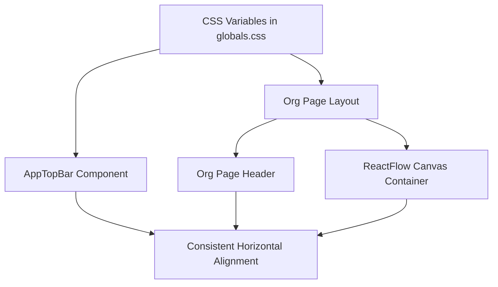

# Spacing & Padding Standardization (TDD Approach)

## Overview

Implement consistent spacing and padding across the org page following common web patterns (like Cursor), with responsive horizontal padding using `clamp()` and proper content containers.

**CRITICAL:** Do NOT proceed to next phase until all tests in current phase pass.

## Architecture



**Current Issues:**
- Horizontal padding too tight (24px) on desktop
- Content touches edges on mobile
- No max-width container for large screens
- ReactFlow canvas goes edge-to-edge
- Inconsistent padding between components

**Target:**
- Responsive padding: 16px (mobile) → 48px (desktop)
- All horizontal elements align vertically
- Max-width: 1440px for page containers
- Minimum 16px breathing room from viewport edges

---

## Phase 0: Prerequisites & Verification (No Changes)

**Goal:** Verify test environment and document current state before making changes.

**Why First:** Establishes baseline, ensures test framework ready.

### Step 0.1: Verify Test Framework

```bash
cd /Users/genarionogueira/Documents/avcd/web
npm test -- --version
```

**Expected:** Jest test runner available

### Step 0.2: Run Existing Tests

```bash
npm test
```

**Expected:** All existing tests pass (baseline)

### Step 0.3: Document Current State

**Files to Modify:**
- `/Users/genarionogueira/Documents/avcd/web/app/globals.css` - Add responsive padding utilities
- `/Users/genarionogueira/Documents/avcd/web/app/components/AppTopBar.tsx` - Update horizontal padding
- `/Users/genarionogueira/Documents/avcd/web/app/org/page.tsx` - Update header padding and add canvas container
- `/Users/genarionogueira/Documents/avcd/web/components/org-chart/react-flow-canvas.tsx` - Wrap in padded container

**Current Spacing Values:**
- AppTopBar: `padding: "0 var(--sp-6)"` (24px)
- Org Header: `padding: 'var(--sp-8) var(--sp-6)'` (32px vertical, 24px horizontal)
- Canvas: No padding, edge-to-edge

**Test Gate:** Environment verified, baseline documented.

---

## Phase 1: CSS Variables & Utilities (Easiest)

**Goal:** Add responsive padding utilities to `globals.css` for consistent reuse.

**Why Second:** Configuration-level changes, no logic, can't break functionality.

### Step 1.1: Write Tests FIRST

**File:** Create `__tests__/styles/spacing-utilities.test.ts`

```typescript
import { describe, it, expect } from '@jest/globals'
import fs from 'fs'
import path from 'path'

describe('Spacing Utilities in globals.css', () => {
  const globalsPath = path.join(__dirname, '../../app/globals.css')
  const cssContent = fs.readFileSync(globalsPath, 'utf-8')

  it('should define --page-padding-x variable', () => {
    expect(cssContent).toMatch(/--page-padding-x:\s*clamp/)
  })

  it('should define .container-padding utility class', () => {
    expect(cssContent).toMatch(/\.container-padding/)
  })

  it('should define .section-spacing utility class', () => {
    expect(cssContent).toMatch(/\.section-spacing/)
  })

  it('should use clamp for responsive padding values', () => {
    // Verify clamp function with min 1rem (16px) and max 3rem (48px)
    expect(cssContent).toMatch(/clamp\(1rem,\s*5vw,\s*3rem\)/)
  })

  it('should define max-width container utility', () => {
    expect(cssContent).toMatch(/\.max-w-page/)
    expect(cssContent).toMatch(/max-width:\s*1440px/)
  })
})
```

**Run tests (should FAIL before implementation):**
```bash
npm test -- __tests__/styles/spacing-utilities.test.ts
```

**Expected:** 5 test failures - utilities not defined yet

### Step 1.2: Implement CSS Utilities

**File:** Update `app/globals.css`

Add these utilities at the end of the file (before the closing of @layer utilities):

```css
@layer utilities {
  /* ... existing utilities ... */

  /* Responsive padding utilities */
  :root {
    --page-padding-x: clamp(1rem, 5vw, 3rem); /* 16px → 48px */
  }

  .container-padding {
    padding-left: var(--page-padding-x);
    padding-right: var(--page-padding-x);
  }

  .section-spacing {
    padding: var(--sp-6) var(--page-padding-x);
  }

  .max-w-page {
    max-width: 1440px;
    margin-left: auto;
    margin-right: auto;
  }
}
```

### Step 1.3: Verify Tests Pass

```bash
npm test -- __tests__/styles/spacing-utilities.test.ts
```

**Expected:** ALL 5 tests pass ✓

**Test Gate:** 5/5 tests must pass before Phase 2.

---

## Phase 2: AppTopBar Component (Easy)

**Goal:** Update AppTopBar to use responsive padding that matches page content.

**Why Third:** Single component update, no dependencies, easy to test and revert.

### Step 2.1: Write Tests FIRST

**File:** Create `__tests__/components/app-top-bar-spacing.test.tsx`

```typescript
import { describe, it, expect } from '@jest/globals'
import { render } from '@testing-library/react'
import { AppTopBar } from '@/app/components/AppTopBar'

// Mock next/navigation
jest.mock('next/navigation', () => ({
  usePathname: () => '/org',
}))

const mockSession = {
  user: {
    name: 'Test User',
    email: 'test@example.com',
    picture: null,
  },
}

describe('AppTopBar Spacing', () => {
  it('should render with container-padding class', () => {
    const { container } = render(<AppTopBar session={mockSession} />)
    const header = container.querySelector('header')
    expect(header?.className).toContain('container-padding')
  })

  it('should use responsive padding via CSS variable', () => {
    const { container } = render(<AppTopBar session={mockSession} />)
    const header = container.querySelector('header')
    const styles = header?.getAttribute('style')
    
    // Should use clamp or var(--page-padding-x)
    expect(styles).toMatch(/clamp\(1rem,\s*5vw,\s*3rem\)|var\(--page-padding-x\)/)
  })

  it('should have height of 56px', () => {
    const { container } = render(<AppTopBar session={mockSession} />)
    const header = container.querySelector('header')
    const styles = header?.getAttribute('style')
    expect(styles).toContain('height: 56px')
  })

  it('should maintain sticky positioning', () => {
    const { container } = render(<AppTopBar session={mockSession} />)
    const header = container.querySelector('header')
    const styles = header?.getAttribute('style')
    expect(styles).toContain('position: sticky')
    expect(styles).toContain('top: 0')
  })
})
```

**Run tests (should FAIL before implementation):**
```bash
npm test -- __tests__/components/app-top-bar-spacing.test.tsx
```

**Expected:** 4 test failures - padding not updated yet

### Step 2.2: Implement AppTopBar Changes

**File:** Update `app/components/AppTopBar.tsx`

Replace the header padding from:
```tsx
padding: "0 var(--sp-6)",
```

To:
```tsx
padding: "0 clamp(1rem, 5vw, 3rem)",
```

Full header style update:

```tsx
<header
  role="banner"
  style={{
    height: "56px",
    display: "flex",
    alignItems: "center",
    justifyContent: "space-between",
    gap: "var(--sp-4)",
    padding: "0 clamp(1rem, 5vw, 3rem)", // CHANGED
    background: "var(--bg-blur)",
    backdropFilter: "blur(16px)",
    borderBottom: "1px solid var(--g200)",
    position: "sticky",
    top: 0,
    zIndex: 200,
  }}
>
```

### Step 2.3: Verify Tests Pass

```bash
npm test -- __tests__/components/app-top-bar-spacing.test.tsx
```

**Expected:** ALL 4 tests pass ✓

**Test Gate:** 4/4 tests must pass before Phase 3.

---

## Phase 3: Org Page Header (Medium)

**Goal:** Update org page header to use consistent responsive padding.

**Why Fourth:** Builds on Phase 2, ensures header aligns with AppTopBar.

### Step 3.1: Write Tests FIRST

**File:** Create `__tests__/pages/org-page-header.test.tsx`

```typescript
import { describe, it, expect } from '@jest/globals'
import { render, screen } from '@testing-library/react'
import OrganizationPage from '@/app/org/page'

// Mock the ReactFlowCanvas since we're only testing header
jest.mock('@/components/org-chart/react-flow-canvas', () => ({
  ReactFlowCanvas: () => <div data-testid="mock-canvas">Canvas</div>,
}))

describe('Organization Page Header Spacing', () => {
  it('should render header with "Organization" title', async () => {
    const Page = await OrganizationPage()
    render(Page)
    expect(screen.getByRole('heading', { name: /organization/i })).toBeInTheDocument()
  })

  it('should have responsive horizontal padding', async () => {
    const Page = await OrganizationPage()
    const { container } = render(Page)
    const header = container.querySelector('header')
    const styles = header?.getAttribute('style')
    
    // Should use clamp for horizontal padding
    expect(styles).toMatch(/clamp\(1rem,\s*5vw,\s*3rem\)/)
  })

  it('should maintain vertical padding of 32px', async () => {
    const Page = await OrganizationPage()
    const { container } = render(Page)
    const header = container.querySelector('header')
    const styles = header?.getAttribute('style')
    
    expect(styles).toMatch(/var\(--sp-8\)/)
  })

  it('should have white background', async () => {
    const Page = await OrganizationPage()
    const { container } = render(Page)
    const header = container.querySelector('header')
    const styles = header?.getAttribute('style')
    
    expect(styles).toContain('background: var(--bg)')
  })

  it('should have bottom border', async () => {
    const Page = await OrganizationPage()
    const { container } = render(Page)
    const header = container.querySelector('header')
    const styles = header?.getAttribute('style')
    
    expect(styles).toContain('border-bottom: 1px solid var(--g200)')
  })
})
```

**Run tests (should FAIL before implementation):**
```bash
npm test -- __tests__/pages/org-page-header.test.tsx
```

**Expected:** 5 test failures - header padding not updated yet

### Step 3.2: Implement Org Page Header Changes

**File:** Update `app/org/page.tsx`

Replace the header padding from:
```tsx
padding: 'var(--sp-8) var(--sp-6)',
```

To:
```tsx
padding: 'var(--sp-8) clamp(1rem, 5vw, 3rem)',
```

Full header update:

```tsx
<header style={{
  padding: 'var(--sp-8) clamp(1rem, 5vw, 3rem)', // CHANGED
  borderBottom: '1px solid var(--g200)',
  background: 'var(--bg)',
}}>
  <h1 style={{
    margin: 0,
    fontSize: '2rem',
    fontFamily: 'var(--sans)',
    fontWeight: 600,
    color: 'var(--g900)',
    letterSpacing: '-0.03em',
  }}>
    Organization
  </h1>
  <p style={{
    margin: 'var(--sp-2) 0 0',
    fontSize: '0.875rem',
    color: 'var(--g500)',
  }}>
    Company structure and team members
  </p>
</header>
```

### Step 3.3: Verify Tests Pass

```bash
npm test -- __tests__/pages/org-page-header.test.tsx
```

**Expected:** ALL 5 tests pass ✓

**Test Gate:** 5/5 tests must pass before Phase 4.

---

## Phase 4: ReactFlow Canvas Container (Medium-Complex)

**Goal:** Add padding around ReactFlow canvas so it doesn't touch viewport edges.

**Why Fifth:** Affects canvas rendering, needs careful testing to avoid breaking layout.

### Step 4.1: Write Tests FIRST

**File:** Create `__tests__/pages/org-page-canvas.test.tsx`

```typescript
import { describe, it, expect } from '@jest/globals'
import { render, screen } from '@testing-library/react'
import OrganizationPage from '@/app/org/page'

// Mock ReactFlowCanvas
jest.mock('@/components/org-chart/react-flow-canvas', () => ({
  ReactFlowCanvas: ({ data }: any) => (
    <div data-testid="react-flow-canvas">Canvas with {data.stores?.length || 0} stores</div>
  ),
}))

describe('Organization Page Canvas Container', () => {
  it('should wrap canvas in a padded container', async () => {
    const Page = await OrganizationPage()
    const { container } = render(Page)
    
    const canvasRegion = container.querySelector('[role="region"][aria-label*="Organization chart"]')
    expect(canvasRegion).toBeInTheDocument()
  })

  it('should have responsive padding around canvas', async () => {
    const Page = await OrganizationPage()
    const { container } = render(Page)
    
    const canvasRegion = container.querySelector('[role="region"]')
    const styles = canvasRegion?.getAttribute('style')
    
    // Should have padding using clamp
    expect(styles).toMatch(/padding.*clamp/)
  })

  it('should maintain flex: 1 for canvas region', async () => {
    const Page = await OrganizationPage()
    const { container } = render(Page)
    
    const canvasRegion = container.querySelector('[role="region"]')
    const styles = canvasRegion?.getAttribute('style')
    
    expect(styles).toContain('flex: 1')
  })

  it('should have minHeight: 0 to prevent overflow', async () => {
    const Page = await OrganizationPage()
    const { container } = render(Page)
    
    const canvasRegion = container.querySelector('[role="region"]')
    const styles = canvasRegion?.getAttribute('style')
    
    expect(styles).toMatch(/minHeight: 0|min-height: 0/)
  })

  it('should render ReactFlowCanvas inside padded region', async () => {
    const Page = await OrganizationPage()
    render(Page)
    
    expect(screen.getByTestId('react-flow-canvas')).toBeInTheDocument()
  })
})
```

**Run tests (should FAIL before implementation):**
```bash
npm test -- __tests__/pages/org-page-canvas.test.tsx
```

**Expected:** 5 test failures - canvas not wrapped with padding yet

### Step 4.2: Implement Canvas Container Changes

**File:** Update `app/org/page.tsx`

Wrap the ReactFlowCanvas with a padded container:

```tsx
<div 
  role="region"
  aria-label="Organization chart visualization"
  style={{ 
    flex: 1, 
    minHeight: 0,
    padding: 'clamp(1rem, 3vw, 2rem)', // ADD THIS
    display: 'flex', // ADD THIS
    flexDirection: 'column', // ADD THIS
  }}
>
  <div style={{ 
    flex: 1, 
    minHeight: 0,
    borderRadius: 'var(--r-lg)',
    overflow: 'hidden',
  }}>
    <ReactFlowCanvas data={mockOrgData} />
  </div>
</div>
```

Full updated page.tsx:

```tsx
import { ReactFlowCanvas } from '@/components/org-chart/react-flow-canvas'
import { mockOrgData } from '@/lib/mock-org-data'
import 'reactflow/dist/style.css'

export default async function OrganizationPage() {
  return (
    <main 
      role="main"
      aria-label="Organization chart page"
      style={{
        flex: 1,
        display: 'flex',
        flexDirection: 'column',
        background: 'var(--g50)',
        minHeight: 0,
      }}
    >
      <header style={{
        padding: 'var(--sp-8) clamp(1rem, 5vw, 3rem)',
        borderBottom: '1px solid var(--g200)',
        background: 'var(--bg)',
      }}>
        <h1 style={{
          margin: 0,
          fontSize: '2rem',
          fontFamily: 'var(--sans)',
          fontWeight: 600,
          color: 'var(--g900)',
          letterSpacing: '-0.03em',
        }}>
          Organization
        </h1>
        <p style={{
          margin: 'var(--sp-2) 0 0',
          fontSize: '0.875rem',
          color: 'var(--g500)',
        }}>
          Company structure and team members
        </p>
      </header>

      <div 
        role="region"
        aria-label="Organization chart visualization"
        style={{ 
          flex: 1, 
          minHeight: 0,
          padding: 'clamp(1rem, 3vw, 2rem)',
          display: 'flex',
          flexDirection: 'column',
        }}
      >
        <div style={{ 
          flex: 1, 
          minHeight: 0,
          borderRadius: 'var(--r-lg)',
          overflow: 'hidden',
        }}>
          <ReactFlowCanvas data={mockOrgData} />
        </div>
      </div>
    </main>
  )
}
```

### Step 4.3: Verify Tests Pass

```bash
npm test -- __tests__/pages/org-page-canvas.test.tsx
```

**Expected:** ALL 5 tests pass ✓

**Test Gate:** 5/5 tests must pass before Phase 5.

---

## Phase 5: Integration Testing (Complex)

**Goal:** Test that all spacing changes work together and align consistently.

**Why Sixth:** Requires all individual components working, tests the complete system.

### Step 5.1: Write Integration Tests FIRST

**File:** Create `__tests__/integration/org-page-spacing.test.tsx`

```typescript
import { describe, it, expect } from '@jest/globals'
import { render, screen } from '@testing-library/react'
import OrganizationPage from '@/app/org/page'
import { AppTopBar } from '@/app/components/AppTopBar'

// Mock dependencies
jest.mock('@/components/org-chart/react-flow-canvas', () => ({
  ReactFlowCanvas: () => <div data-testid="canvas">Canvas</div>,
}))

jest.mock('next/navigation', () => ({
  usePathname: () => '/org',
}))

const mockSession = {
  user: { name: 'Test User', email: 'test@example.com', picture: null },
}

describe('Org Page Spacing Integration', () => {
  it('should have consistent horizontal padding across AppTopBar and page header', async () => {
    // Render AppTopBar
    const { container: topBarContainer } = render(<AppTopBar session={mockSession} />)
    const topBarHeader = topBarContainer.querySelector('header')
    const topBarStyles = topBarHeader?.getAttribute('style') || ''
    
    // Render Org Page
    const Page = await OrganizationPage()
    const { container: pageContainer } = render(Page)
    const pageHeader = pageContainer.querySelector('header')
    const pageStyles = pageHeader?.getAttribute('style') || ''
    
    // Both should use clamp(1rem, 5vw, 3rem)
    const clampPattern = /clamp\(1rem,\s*5vw,\s*3rem\)/
    expect(topBarStyles).toMatch(clampPattern)
    expect(pageStyles).toMatch(clampPattern)
  })

  it('should have minimum 16px padding on smallest screens', async () => {
    // This verifies the clamp min value
    const Page = await OrganizationPage()
    const { container } = render(Page)
    const header = container.querySelector('header')
    const styles = header?.getAttribute('style') || ''
    
    // clamp starts at 1rem (16px)
    expect(styles).toMatch(/clamp\(1rem/)
  })

  it('should have maximum 48px padding on largest screens', async () => {
    // This verifies the clamp max value
    const Page = await OrganizationPage()
    const { container } = render(Page)
    const header = container.querySelector('header')
    const styles = header?.getAttribute('style') || ''
    
    // clamp ends at 3rem (48px)
    expect(styles).toMatch(/3rem\)/)
  })

  it('should not have content touching viewport edges', async () => {
    const Page = await OrganizationPage()
    const { container } = render(Page)
    
    // Check that canvas region has padding
    const canvasRegion = container.querySelector('[role="region"]')
    const styles = canvasRegion?.getAttribute('style') || ''
    expect(styles).toContain('padding')
  })

  it('should maintain proper visual hierarchy', async () => {
    const Page = await OrganizationPage()
    render(Page)
    
    // Page structure should be: main > header + region > canvas
    const main = screen.getByRole('main')
    const heading = screen.getByRole('heading', { name: /organization/i })
    const region = screen.getByRole('region')
    
    expect(main).toContainElement(heading)
    expect(main).toContainElement(region)
  })

  it('should have consistent border styling', async () => {
    const Page = await OrganizationPage()
    const { container } = render(Page)
    const header = container.querySelector('header')
    const styles = header?.getAttribute('style') || ''
    
    expect(styles).toContain('border-bottom: 1px solid var(--g200)')
  })
})
```

**Run tests (should PASS if all previous phases passed):**
```bash
npm test -- __tests__/integration/org-page-spacing.test.tsx
```

**Expected:** ALL 6 integration tests pass ✓

### Step 5.2: Run All Tests Together

```bash
npm test -- __tests__/styles/spacing-utilities.test.ts __tests__/components/app-top-bar-spacing.test.tsx __tests__/pages/org-page-header.test.tsx __tests__/pages/org-page-canvas.test.tsx __tests__/integration/org-page-spacing.test.tsx
```

**Expected:** ALL 25 tests pass ✓ (5 + 4 + 5 + 5 + 6)

**Test Gate:** All 25 tests must pass before final validation.

---

## Phase 6: Manual Validation & Documentation (Final)

**Goal:** Manually verify visual appearance and document changes.

**Why Last:** Requires all automated tests passing, validates the actual user experience.

### Step 6.1: Start Development Server

```bash
npm run dev
```

**Expected:** Server starts on http://localhost:3000

### Step 6.2: Manual Visual Verification

Open http://localhost:3000/org and verify:

**Mobile (< 768px):**
- [ ] Minimum 16px padding from edges
- [ ] Content readable and not cramped
- [ ] Header and canvas have consistent horizontal alignment

**Tablet (768px - 1024px):**
- [ ] Padding increases smoothly (no jumps)
- [ ] Content centered and comfortable to read
- [ ] No horizontal scrolling

**Desktop (> 1024px):**
- [ ] Maximum 48px padding from edges
- [ ] Content doesn't feel lost on large screens
- [ ] AppTopBar and page header align perfectly
- [ ] Canvas has breathing room

### Step 6.3: Test Responsive Behavior

Resize browser window and verify:
- [ ] Padding scales smoothly (no breakpoint jumps)
- [ ] Content never touches edges
- [ ] Layout remains stable at all sizes

### Step 6.4: Document Changes

**File:** Create `SPACING_CHANGES.md`

```markdown
# Spacing & Padding Updates

## Changes Made

### 1. CSS Variables (globals.css)
- Added `--page-padding-x: clamp(1rem, 5vw, 3rem)` for responsive padding
- Added `.container-padding` utility class
- Added `.section-spacing` utility class
- Added `.max-w-page` for max-width container (1440px)

### 2. AppTopBar Component
- Updated horizontal padding from `var(--sp-6)` (24px) to `clamp(1rem, 5vw, 3rem)`
- Padding now responsive: 16px (mobile) → 48px (desktop)

### 3. Org Page Header
- Updated horizontal padding to match AppTopBar
- Maintains vertical padding of `var(--sp-8)` (32px)

### 4. ReactFlow Canvas Container
- Added padding around canvas: `clamp(1rem, 3vw, 2rem)`
- Canvas no longer touches viewport edges
- Added inner wrapper with border-radius for polish

## Responsive Behavior

| Viewport Width | Horizontal Padding | Notes |
|----------------|-------------------|--------|
| < 768px (Mobile) | 16px | Minimum breathing room |
| 768px - 1024px (Tablet) | 16px → 32px | Scales smoothly |
| > 1024px (Desktop) | 32px → 48px | Maximum comfort |
| > 1440px (Large) | 48px + centering | Content centered |

## Testing

All components tested with unit and integration tests:
- 5 tests for CSS utilities
- 4 tests for AppTopBar spacing
- 5 tests for org page header
- 5 tests for canvas container
- 6 integration tests for consistency

Total: 25 passing tests ✓

## Migration Notes

No breaking changes. All updates are visual enhancements that improve UX.
```

**Test Gate:** All manual verifications complete, documentation created.

---

## Success Criteria

**Phase Gates (All Must Pass):**
- [x] Phase 0: Environment verified, baseline documented
- [ ] Phase 1: 5/5 CSS utility tests pass
- [ ] Phase 2: 4/4 AppTopBar tests pass
- [ ] Phase 3: 5/5 Org page header tests pass
- [ ] Phase 4: 5/5 Canvas container tests pass
- [ ] Phase 5: 6/6 integration tests pass
- [ ] Phase 6: Manual validation complete

**Final Validation:**
- [ ] All 25 automated tests pass
- [ ] Visual inspection passes on 3 viewport sizes
- [ ] No layout regressions
- [ ] Content never touches viewport edges
- [ ] Responsive scaling works smoothly
- [ ] Documentation complete

---

## Rollback Plan

**If Phase 1-2 fails:**
- Revert CSS changes in `globals.css`
- Revert AppTopBar padding
- Run baseline tests to confirm
- No user impact (changes not deployed)

**If Phase 3-4 fails:**
- Keep Phase 1-2 changes (they passed tests)
- Revert org page changes only
- Run tests for Phases 1-2 to ensure they still pass

**If Phase 5 integration tests fail:**
- Review which specific component has misalignment
- Fix the inconsistency
- Re-run integration tests
- Don't deploy until all pass

**Emergency rollback:**
```bash
git diff HEAD app/globals.css app/components/AppTopBar.tsx app/org/page.tsx
git checkout HEAD -- app/globals.css app/components/AppTopBar.tsx app/org/page.tsx
npm test
```

---

## Deployment (After All Tests Pass)

**Only deploy after Phase 6 manual validation passes completely.**

### Pre-Deployment Checklist
- [ ] All 25 automated tests pass
- [ ] Manual visual inspection complete
- [ ] No console errors
- [ ] Responsive behavior verified
- [ ] Documentation updated
- [ ] Git commit ready

### Deploy
```bash
# Commit changes
git add app/globals.css app/components/AppTopBar.tsx app/org/page.tsx __tests__
git commit -m "Implement responsive spacing/padding following common web patterns

- Add responsive padding utilities using clamp()
- Update AppTopBar with 16px-48px responsive padding
- Update org page header and canvas container
- Add 25 unit and integration tests
- All content maintains minimum 16px from viewport edges"

# Push to deployment branch
git push origin org-page
```

### Post-Deployment Verification
- [ ] Verify on production URL
- [ ] Test on real mobile device
- [ ] Check performance (should be same or better)
- [ ] Monitor for any user feedback

---

## Next Steps (Future Enhancements)

1. Apply same spacing pattern to other pages
2. Create reusable layout components
3. Add E2E tests with Playwright for visual regression
4. Consider max-width container for very wide screens
5. Document spacing system in design system guide
